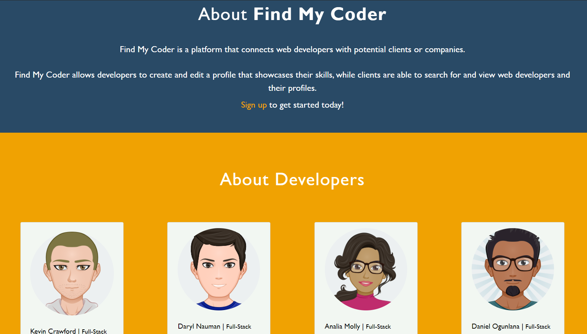
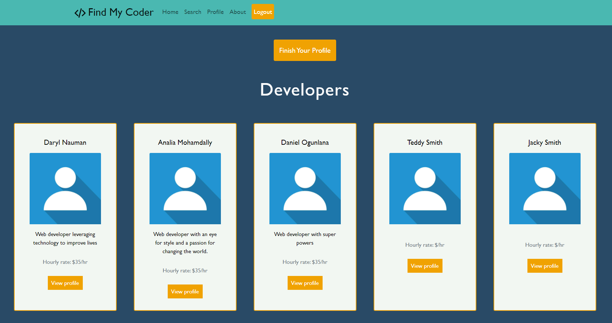
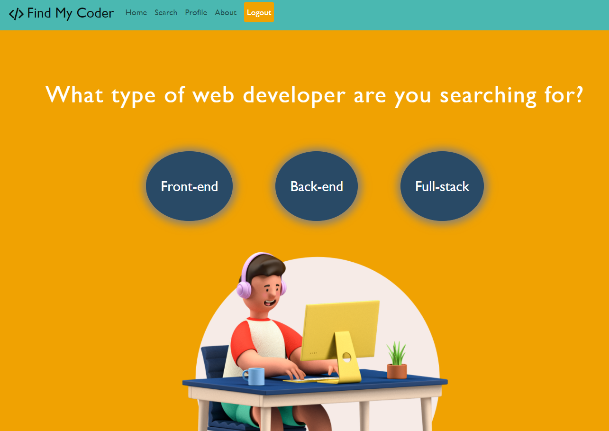

# Find My Coder

## Table of Contents

[Description](#description)

[Technology](#technology)

[Installation](#installation)

[Links](#links)

[Usage](#usage)

[Screenshots](#screenshots)

[Development Team](#development-team)

[Contributing](#contributing)

[Questions](#questions)

[License](#license)

## Description
Find My Coder is a platform that connects web developers with potential clients or companies. It allows developers to create and edit a profile that showcases their skills, while clients can search for and view web developers and their profiles. Web development is the niche market that this application supports. It connects web developers and clients that are looking to easily find developers who can meet their specific needs. The application takes the work out of having to sift through other types of freelancers.

## Technology
Key technologies and npm packages used in this project:
- Mongo DB, Mongo Atlas & Mongoose
- Express.js
- React
- Node.js
- GraphQL
- HTML
- CSS (including Bootstrap & react-bootstrap)
- JavaScript
- bcrypt
- Apollo Server Express
- JSON web tokens (via jsonwebtoken & jwt-decode)
- react-router-dom

## Installation
Fork a copy of the repository, install dependencies by running 'npm install' followed by 'npm run develop' to launch both the front-end and back-end servers.

## Links
- [GitHub repository](https://github.com/AnaMolly/Code_Solutions)
- [Deployed application](https://find-my-coder.herokuapp.com/)

## Usage
Visit our deployed application and create either a developer or client account based on your needs. Developers can further update their profile once they have created their account. Clients can view all developers together or search them by their primary focus (e.g., front-end developers).

## Screenshots
#### Main Landing Page

#### About Page

#### Home Page (Developers)

#### Search Page

## Development Team
Analia Mohamdally
- [Email](mailto:analia.mohamdally@gmail.com)
- [GitHub](https://github.com/AnaMolly)

Daryl Nauman
- [Email](mailto:darylnauman@gmail.com)
- [GitHub](https://github.com/darylnauman)

Daniel Ogunlana
- [Email](mailto:danielogunlana23@gmail.com)
- [GitHub](https://github.com/Daniel-ipymb)

Kevin Crawford
- [Email](mailto:crawfordkevin101@gmail.com)
- [GitHub](https://github.com/kcrawford101)

## Contributing
Please contact a member of the development team if you wish to contribute to this application.

## Questions
Please contact any members of our team.

## License
This product is under the MIT License.